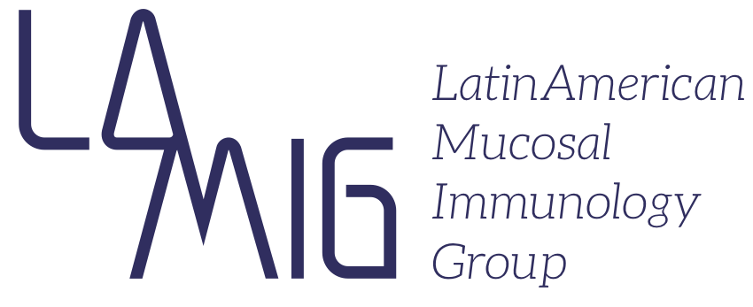

## Sobre o evento

De 7 a 9 de julho de 2016, Belo Horizonte, Brasil, será palco do encontro inaugural do Latin American Mucosal Immunology Group (LAMIG), uma iniciativa que promete fortalecer a pesquisa em imunologia de mucosas em toda a região. O evento contará com duas atividades principais: o Workshop em Imunologia de Mucosas e uma reunião estratégica para a formalização da rede.

O workshop incluirá apresentações de renomados cientistas latino-americanos e palestras de dois convidados internacionais de destaque: Daniel Mucida (The Rockefeller University) e Kevin Maloy (Oxford University). Eles trarão discussões inspiradoras sobre os avanços da área e participarão ativamente de interações com os participantes.

Na reunião estratégica, representantes de diversos países da América Latina irão traçar as diretrizes do LAMIG, uma rede criada para promover colaborações científicas, intercâmbios acadêmicos e avanços na pesquisa em imunologia de mucosas.

Não perca a chance de fazer parte desse momento histórico e contribuir para o futuro da imunologia de mucosas na América Latina. Marque na agenda e prepare-se para participar!

### Mais informações
[Site oficial do LAMIG](https://lamig0716.wixsite.com/lamig)

{: .t60 }


