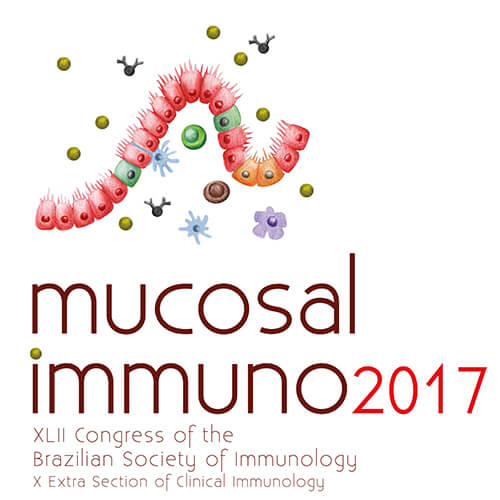

## Sobre o evento

De 2 a 6 de outubro de 2017, o Hotel Deville em Salvador, Bahia, será o cenário do XLII Encontro Anual da Sociedade Brasileira de Imunologia (SBI). Este congresso, reconhecido como um dos maiores eventos científicos da área, terá como tema principal a Imunologia de Mucosas, uma área de crescente relevância para a saúde humana. Além de oferecer um ambiente culturalmente rico e de paisagens deslumbrantes, Salvador proporcionará uma experiência enriquecedora para os pesquisadores.

A Imunologia de Mucosas, antes considerada uma área marginal, emergiu como uma disciplina central após descobertas que ligaram a microbiota intestinal e componentes da dieta a doenças inflamatórias intestinais, autoimunidade, alergias, obesidade e até distúrbios neurológicos, como o autismo. Durante o congresso, líderes em pesquisa do Brasil e de outros 15 países discutirão os avanços mais significativos nessa área.

O programa científico incluirá temas como respostas imunes em mucosas, impacto da microbiota em doenças humanas, probióticos e dietas no sistema imunológico, vacinas mucosas, infecções e tumores, além de doenças inflamatórias e efeitos regulatórios da tolerância oral. O evento também será palco do 10º Extra-Simpósio de Imunologia Clínica e do 2º Encontro do Latin American Mucosal Immunology Group (LAMIG), reforçando seu papel como catalisador para a colaboração científica regional.

Para o Grupo de Estudos em Mucosas e Pele, este congresso é uma oportunidade única de troca de conhecimentos, alinhamento com as tendências globais e fortalecimento de colaborações na América Latina. Além disso, o evento celebrará o papel das mulheres na imunologia com prêmios para pesquisadoras seniores e jovens talentos, destacando suas contribuições para a ciência.

Não perca essa chance de fazer parte de um evento que moldará o futuro da imunologia. Nos vemos em Salvador!

### Mais informações e inscrições
[Congresso SBI 2017](http://sbicongressos.com/immuno2017)

{: .t60 }


