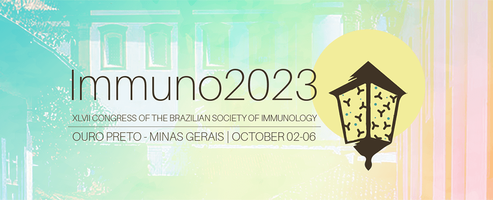

Este evento será uma oportunidade única para fortalecer a interação entre o Fio-Mucosa e a comunidade científica global, reunindo especialistas de renome para discutir os avanços mais recentes em imunologia de mucosas, vacinas, imunoterapia, imunossenescência, além de doenças autoimunes e inflamatórias. A programação contará com simpósios, workshops e palestras, e contará com uma presença significativa de jovens pesquisadores, refletindo o esforço contínuo do Fio-Mucosa em integrar novas gerações ao campo da pesquisa.

A realização conjunta com o Congresso da SBI destaca a relevância do Fio-Mucosa como um centro de excelência na pesquisa translacional em imunologia de mucosas, promovendo discussões de alto nível e fortalecendo a colaboração entre cientistas de diversas partes do mundo. Ouro Preto será o cenário perfeito para este evento de grande importância para a ciência.

### Mais informações

[Site do Congresso SBI 2023](https://immuno2023.sbi.org.br/)

{: .t60 }


