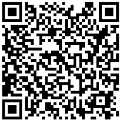

## O evento

O curso/simpósio incluirá os conceitos básicos e a organização do sistema imunológico associado às mucosas, interações com microrganismos, regulação das respostas imunológicas e avanços na área. O evento será imersivo e interativo, com palestras, discussões, apresentações de pôsteres e apresentações orais. O Grupo Latino-Americano de Imunologia de Mucosas está organizando o curso, com o apoio da UFRJ e da FIOCRUZ.

### Inscrições

    

    As inscrições aconteceram de 01 de Maio a 03 de Junho e serão gratuitas. Para se inscrever, basta escanear o QRCode ao lado. 50 participantes ao todo serão selecionados (entre alunos e pós-doutorandos). Para a inscrição, os interessados deverão submeter um resumo do seu projeto e uma carta de interesse.
    

    <figure style="width:100%">
     
    
<figcaption>2º ACMI - Inscrições</figcaption>

    </figure>

### Bolsas

Será oferecido acomodação e alimentação. Transporte será parcialmente coberto para estudantes selecionados.

### Informações aos participantes

Todos os participantes precisarão levar uma apresentação em poster. Os participantes também serão selecionados para apresentações orais. O evento contará com diversas palestras de experts na área.

### Mais informações



{: .t60 }


