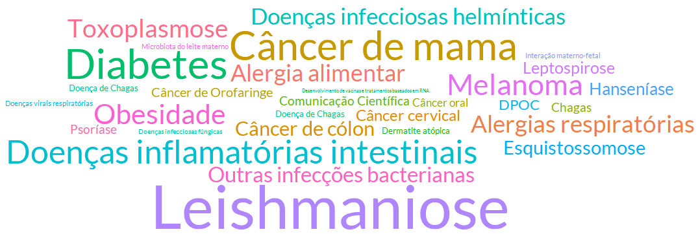
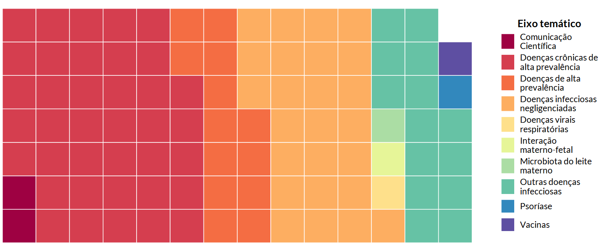
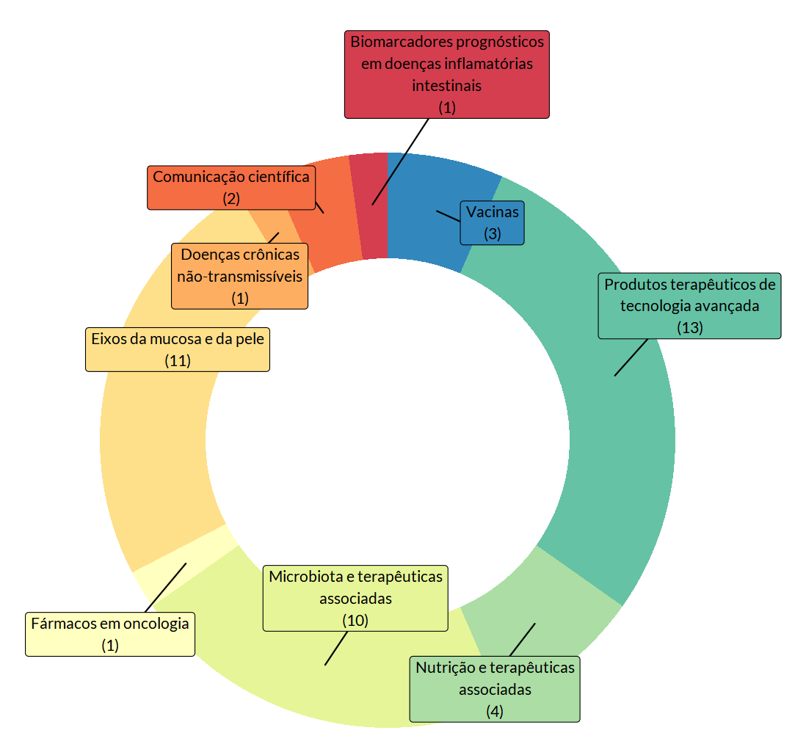

# Sobre nós

O Grupo de Estudos em Mucosas e Pele é uma rede colaborativa de pesquisadores dedicados ao estudo das doenças que afetam mucosas e pele, com ênfase em sua patogênese, imunologia e alternativas terapêuticas. Nosso objetivo é gerar conhecimento científico de excelência e promover inovações que contribuam para a prevenção, diagnóstico e tratamento de doenças infecciosas, virais, crônicas e imunológicas, impactando positivamente a saúde pública. Atuamos em projetos multidisciplinares que abrangem desde doenças negligenciadas até condições de alta prevalência, fortalecendo a integração entre instituições nacionais e internacionais, e formando novos talentos na área por meio de parcerias acadêmicas, eventos científicos e iniciativas de capacitação.

## Eixos temáticos

Os pesquisadores do GEMP trabalham com diversas linhas de pesquisa.

 

Assim, o grupo organiza suas atividades de pesquisa em torno de eixos temáticos que abrangem questões de grande relevância científica e impacto na saúde pública. 

 

Esses eixos norteiam as investigações científicas, permitindo ao grupo contribuir significativamente para o avanço no entendimento das patologias e o desenvolvimento de novas terapias, se desdobrando em diversos eixos transversais.

