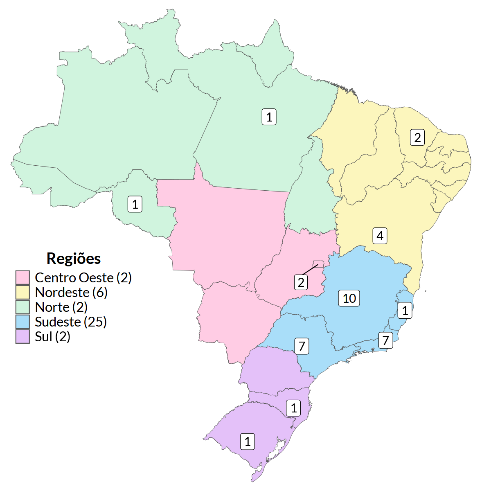
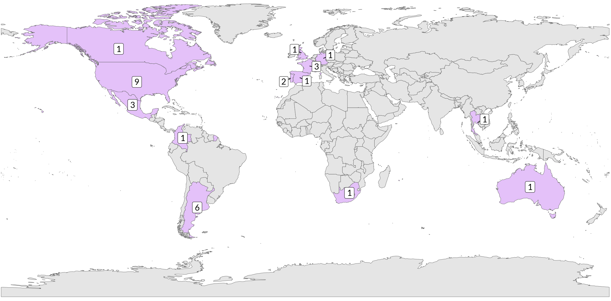

# Sobre nós

O Grupo de Estudos em Mucosas e Pele é uma rede colaborativa de pesquisadores dedicados ao estudo das doenças que afetam mucosas e pele, com ênfase em sua patogênese, imunologia e alternativas terapêuticas. Nosso objetivo é gerar conhecimento científico de excelência e promover inovações que contribuam para a prevenção, diagnóstico e tratamento de doenças infecciosas, virais, crônicas e imunológicas, impactando positivamente a saúde pública. Atuamos em projetos multidisciplinares que abrangem desde doenças negligenciadas até condições de alta prevalência, fortalecendo a integração entre instituições nacionais e internacionais, e formando novos talentos na área por meio de parcerias acadêmicas, eventos científicos e iniciativas de capacitação.

## Eixos temáticos

Os pesquisadores do GEMP trabalham com diversas linhas de pesquisa.

 

Assim, o grupo organiza suas atividades de pesquisa em torno de eixos temáticos que abrangem questões de grande relevância científica e impacto na saúde pública. 

 

Esses eixos norteiam as investigações científicas, permitindo ao grupo contribuir significativamente para o avanço no entendimento das patologias e o desenvolvimento de novas terapias, se desdobrando em diversos eixos transversais.

  

## Integrantes

    

    Atualmente, o grupo conta com uma extensa lista de integrantes e a participação das seguintes instituições:   
    <u>
    <li>FIOCRUZ-RD</li>
    <li>FIOCRUZ-BA</li>
    <li>FIOCRUZ-CE</li>
    <li>FIOCRUZ-MG</li>
    <li>FIOCRUZ-RJ (IOC)</li>
    <li>UnB</li>
    <li>UFMG</li>
    <li>UFV</li>
    <li>UFRJ</li>
    <li>UFF</li>
    <li>USP</li>
    <li>USP-RP</li>
    <li>UNICAMP</li>
    <li>UFES</li>
    <li>UFSC</li>
    <li>PUC-RS</li>
    </u>

     Para saber mais sobre os integrantes, <a href="({{ site.url }}{{ site.baseurl }}/group/">clique aqui</a>.
    

    
    

## Colaborações internacionais

Os integrantes do grupo mantém uma ampla rede de colaborações internacionais, fortalecendo suas pesquisas por meio de parcerias com instituições renomadas em diferentes países:

#### Américas
* Guilhermo Docena – Universidad de La Plata, Argentina
* Pablo Romagno – Universidad de La Plata, Argentina
* Leticia Fierros – Universidad Nacional de México (UNAM), México
* Michalel Schnorr – Universidad Nacional de México (UNAM), México
* Leopoldo Argumedo – CINVESTAV, México
* Maria Adelaida Gomes – ICESI University, Colômbia
* Howard Weiner – Harvard Medical School, Boston
* Rafael Rezende – Harvard Medical School, Boston
* Thais Moreira – Harvard Medical School, Boston
* Daniel Mucida – The Rockefeller University, Nova York
* Maria Curotto de Lafaille – Mount Sinai Medical Center, Nova York
* Cecília Canesso – Einstein College of Medicine, Nova York

#### Europa
* Jean-Marc Chatel – Institute Micolis, INRA, França
* Philippe Langela – Institute Micolis, INRA, França
* Luis Graça – Instituto de Medicina Molecular, Universidade de Lisboa, Portugal
* Bruno Santos – Instituto de Medicina Molecular, Universidade de Lisboa, Portugal
* Gustavo Ramos – University of Würzburg, Alemanha
* Arne Akbar – University College London, Reino Unido

Essas colaborações internacionais são fundamentais para o avanço de projetos em imunologia, com foco em novas abordagens terapêuticas e na compreensão dos mecanismos de doenças crônicas e infecciosas.